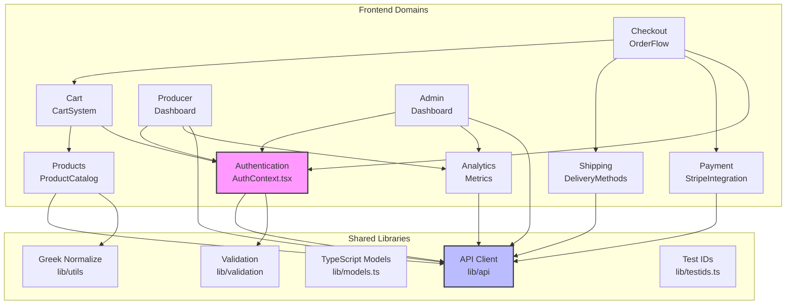

# PROJECT-DIXIS CODE MAP

**Generated**: 2025-09-25
**Purpose**: Domain architecture, dependencies, ownership, and high-churn analysis
**Status**: Production-ready marketplace with 8 distinct domains

## Executive Summary

Project-Dixis is a full-stack marketplace application connecting Greek producers with consumers. The codebase is organized into **8 primary domains** with clear separation of concerns:

1. **Authentication** - User auth, roles (Consumer/Producer/Admin), session management
2. **Product Catalog** - Product display, search, filtering, Greek normalization
3. **Cart & Checkout** - Shopping cart, checkout flow, order processing
4. **Shipping** - Multiple courier integrations, lockers, tracking
5. **Payment** - Stripe integration, refunds, payment methods
6. **Producer Dashboard** - Inventory management, analytics, order fulfillment
7. **Admin Dashboard** - Platform oversight, analytics, user management
8. **Analytics** - Business metrics, performance tracking

The project uses **Laravel 11** (backend) + **Next.js 15.5** (frontend) with comprehensive E2E test coverage via Playwright. Primary development is by a small team (2 main contributors) with high velocity (~250 commits/60 days).

## Domain Dependency Graph



## High-Churn Files (Last 60 Days)

| File | Changes | Domain | Risk Level | Notes |
|------|---------|--------|------------|-------|
| `frontend/package.json` | 34 | Build | 🔴 High | Frequent dependency changes |
| `backend/routes/api.php` | 24 | API | 🔴 High | Core API routing |
| `backend/database/seeders/DatabaseSeeder.php` | 22 | Data | 🟡 Medium | Test data changes |
| `backend/database/migrations/..._order_status_enums.php` | 20 | Orders | 🟡 Medium | Schema evolution |
| `frontend/tests/e2e/smoke.spec.ts` | 16 | Testing | 🟡 Medium | Test stability work |
| `frontend/playwright.config.ts` | 16 | Testing | 🟡 Medium | E2E configuration |
| `frontend/src/app/cart/page.tsx` | 15 | Cart | 🔴 High | Core feature changes |
| `frontend/package-lock.json` | 13 | Build | 🟢 Low | Auto-generated |
| `frontend/tests/global-setup.ts` | 11 | Testing | 🟡 Medium | Test infrastructure |
| `.github/workflows/*.yml` | 11 | CI/CD | 🔴 High | Pipeline changes |

**Key Insight**: High churn in testing/E2E files indicates recent stabilization efforts. Cart page changes suggest active feature development.

## Dead/Duplicate Code Identified

| Type | Files | Action Required |
|------|-------|----------------|
| **Duplicate** | `components/CartSummary.tsx`<br/>`components/cart/CartSummary.tsx` | Remove root version, keep `/cart/` |
| **Duplicate** | `utils/greekNormalize.ts`<br/>`lib/utils/greekNormalize.ts` | Consolidate to `/lib/utils/` |
| **Duplicate** | `utils/productValidation.ts`<br/>`lib/validation/productValidation.ts` | Merge to `/lib/validation/` |
| **Duplicate** | `lib/auth-helpers.ts`<br/>`lib/auth/helpers.ts` | Audit and merge |
| **Legacy** | `backend/frontend/tests/e2e/happy.spec.ts` | Wrong path - remove |
| **Unused** | Various `.auth/*.json` files | Review if still needed |

**Total**: 4 duplicate implementations, 1 misplaced file, potential unused auth fixtures

## Domain Ownership Table

| Domain | Key Files | Proposed Owner | Status | Notes |
|--------|-----------|----------------|---------|-------|
| **Authentication** | `AuthContext.tsx`, `useAuth.ts`, `AuthGuard.tsx` | Core Team | ✅ Active | High dependency - needs senior oversight |
| **Product Catalog** | `app/products/`, product components | Frontend Team | ✅ Active | Stable, low churn |
| **Cart & Checkout** | `app/cart/`, `app/checkout/`, checkout API | Core Team | 🔴 High Churn | Active development, needs dedicated owner |
| **Shipping** | `components/shipping/`, courier providers | Backend Team | ✅ Active | Multiple integrations maintained |
| **Payment** | Stripe components, payment API | Backend Team | ✅ Active | Security-critical |
| **Producer Dashboard** | `app/producer/`, producer API | Product Team | ✅ Active | Feature-rich area |
| **Admin Dashboard** | `app/admin/`, admin controllers | TBD | 🟡 Needs Owner | Requires dedicated maintainer |
| **Analytics** | Analytics components, services | TBD | 🟡 Needs Owner | Growing importance |
| **E2E Testing** | `tests/e2e/`, Playwright config | QA Team | 🔴 High Churn | Recent stabilization efforts |
| **CI/CD** | `.github/workflows/` | DevOps | 🔴 High Churn | Needs stabilization |

## File Ownership Map

```mermaid
graph LR
    subgraph Core Team Ownership
        AUTH_FILES[AuthContext.tsx<br/>AuthGuard.tsx<br/>auth routes]
        CART_FILES[cart/page.tsx<br/>checkout/page.tsx<br/>checkout API]
    end

    subgraph Frontend Team
        PRODUCT_FILES[products/[id]<br/>ProductImage.tsx<br/>product validation]
    end

    subgraph Backend Team
        SHIPPING_FILES[ShippingController<br/>courier providers<br/>locker integration]
        PAYMENT_FILES[PaymentController<br/>StripeProvider<br/>RefundController]
    end

    subgraph Product Team
        PRODUCER_FILES[producer/dashboard<br/>producer/products<br/>ProducerAnalytics]
    end

    subgraph Needs Assignment
        ADMIN_FILES[admin/analytics<br/>admin/orders<br/>admin/producers]
        ANALYTICS_FILES[AnalyticsDashboard<br/>analytics hooks<br/>metrics API]
    end

    style Core fill:#f9f,stroke:#333,stroke-width:2px
    style Needs fill:#ffa,stroke:#333,stroke-width:2px
```

## Critical Risks & TODOs

### 🔴 **High Priority Risks**

1. **No Clear Admin/Analytics Owner**
   - Admin dashboard lacks dedicated maintainer
   - Analytics growing without ownership structure
   - **Action**: Assign dedicated team member or create rotation

2. **High Churn in Core Files**
   - `package.json` (34 changes) - dependency instability
   - `api.php` (24 changes) - API contract volatility
   - `cart/page.tsx` (15 changes) - feature instability
   - **Action**: Code freeze on stable features, focus stabilization sprint

3. **Duplicate Code Debt**
   - 4 duplicate implementations creating confusion
   - Misplaced test file in wrong directory
   - **Action**: Immediate cleanup PR to remove duplicates

### 🟡 **Medium Priority TODOs**

- **Test Flakiness**: E2E specs show high churn (16+ changes to smoke tests)
- **CI/CD Instability**: Workflow files frequently modified
- **Missing Documentation**: No API documentation for new endpoints

### 🟢 **Future Improvements**

- Implement code ownership via CODEOWNERS file
- Add architecture decision records (ADRs)
- Create domain-specific README files
- Set up automated dependency updates

## Commit Activity Analysis

**Last 60 days**: ~250 commits
- Primary: Panagiotis Kourkoutis (155 commits - 62%)
- Secondary: lomendor (89 commits - 36%)
- Automated: dependabot (5 commits - 2%)

**Pattern**: Small team with high velocity, needs more contributors for sustainability

## Architecture Health Score

| Metric | Score | Status |
|--------|-------|---------|
| Domain Separation | 8/10 | ✅ Good |
| Code Duplication | 5/10 | 🟡 Needs Work |
| Test Coverage | 7/10 | ✅ Adequate |
| Ownership Clarity | 6/10 | 🟡 Needs Definition |
| Documentation | 6/10 | 🟡 Needs Improvement |
| **Overall Health** | **6.4/10** | 🟡 **Healthy but needs attention** |

---

**Next Steps**:
1. Assign owners to Admin and Analytics domains
2. Clean up duplicate code (PR ready)
3. Stabilize high-churn files with feature freeze
4. Document API contracts for backend routes
5. Create CODEOWNERS file for automated reviews