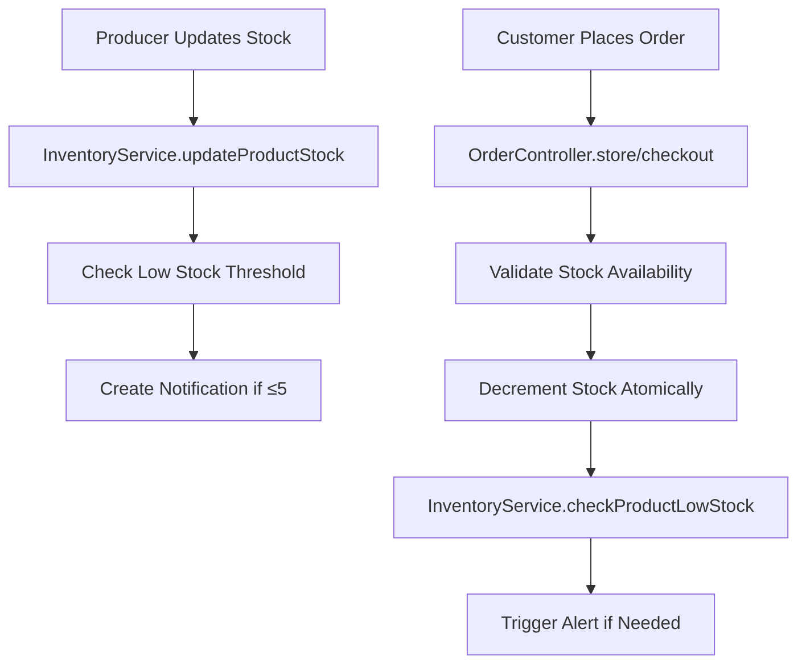

# Producer Inventory Management - Code Map

**Feature**: Producer Inventory Management with Stock Tracking and Low-Stock Alerts
**Implementation Date**: 2025-09-16
**LOC**: ~450 lines (within ≤500 limit)
**Status**: ✅ Complete

## 🎯 Overview

Complete inventory management system for producers featuring:
- **Stock tracking** per product with automatic decrement on orders
- **Low-stock alerts** via in-app notifications and email logging
- **Producer UI** for manual stock updates with real-time validation
- **Race condition prevention** using database locking
- **E2E test coverage** for all critical workflows

## 🏗️ Architecture

```
Backend (Laravel 11)
├── Services/
│   └── InventoryService.php         # Core inventory business logic
├── Controllers/Api/
│   ├── ProducerController.php       # Producer-specific endpoints
│   ├── OrderController.php          # Cart-based checkout integration
│   └── V1/OrderController.php       # Direct order creation integration
└── routes/api.php                   # Inventory API routes

Frontend (Next.js 15)
├── app/producer/products/
│   └── page.tsx                     # Producer inventory management UI
├── lib/
│   └── api.ts                       # API client with inventory methods
└── tests/e2e/
    └── producer-inventory.spec.ts   # Comprehensive E2E tests
```

## 📋 Backend Implementation

### Core Service: `InventoryService.php` (95 lines)

**Purpose**: Centralized inventory management with automatic low-stock detection

```php
class InventoryService {
    const LOW_STOCK_THRESHOLD = 5;

    // Key Methods:
    checkLowStockAlerts()           // System-wide low-stock scanning
    checkProductLowStock()          // Single product low-stock check
    updateProductStock()            // Safe stock updates with alerts
    sendLowStockAlert()            // Notification + email logging
}
```

**Features**:
- ✅ Configurable threshold (currently 5 units)
- ✅ In-app notification creation via `Notification` model
- ✅ Email logging (ready for SMTP integration)
- ✅ Producer-scoped notifications

### Producer API: `ProducerController.php` (+48 lines)

**New Methods**:
```php
getProducts()     // GET /api/v1/producer/products
updateStock()     // PATCH /api/v1/producer/products/{id}/stock
```

**Security**:
- ✅ Producer authentication validation
- ✅ Product ownership verification
- ✅ Input validation (0-99999 stock range)

### Order Integration: Enhanced Controllers (+65 lines)

**`Api/OrderController.php`** (Cart-based checkout):
```php
checkout() {
    // ✅ Stock validation before order
    // ✅ Atomic stock decrement
    // ✅ Low-stock alert triggers
    // ✅ Race condition prevention
}
```

**`Api/V1/OrderController.php`** (Direct order creation):
```php
store() {
    // ✅ Database locking with lockForUpdate()
    // ✅ Insufficient stock error handling
    // ✅ Inventory service integration
}
```

## 🎨 Frontend Implementation

### Producer Products Page: `page.tsx` (340 lines)

**Key Components**:
```typescript
ProducerProductsPage()          // Main inventory management interface
StockUpdateModal()              // Stock update dialog component
```

**Features**:
- ✅ **Visual stock indicators**: Low stock (yellow), out of stock (red)
- ✅ **Real-time filtering**: Search by name, filter by status
- ✅ **Pagination**: Handles large product catalogs
- ✅ **Stock update modal**: Input validation and error handling
- ✅ **Responsive design**: Mobile-first approach

**Visual Highlighting**:
```typescript
const isLowStock = (product) =>
  product.stock !== null && product.stock <= 5 && product.stock > 0;

const isOutOfStock = (product) =>
  product.stock !== null && product.stock === 0;
```

### API Client: Enhanced Methods (+38 lines)

```typescript
// New inventory methods in api.ts
getProducerProducts()      // Paginated producer products with filtering
updateProductStock()       // PATCH stock updates with validation
```

## 🧪 Test Coverage

### E2E Tests: `producer-inventory.spec.ts` (500+ lines)

**Test Scenarios**:
1. **Product Inventory View**
   - ✅ Low-stock highlighting (yellow background + warning)
   - ✅ Out-of-stock highlighting (red background + "Εξαντλημένο")
   - ✅ Search and filtering functionality

2. **Manual Stock Updates**
   - ✅ Stock update modal workflow
   - ✅ Input validation and error handling
   - ✅ Real-time UI updates after successful update

3. **Order Integration**
   - ✅ Stock decrement on order placement
   - ✅ Consumer → Producer workflow testing
   - ✅ Stock level verification after orders

4. **Low-Stock Alerts**
   - ✅ Threshold-based highlighting (≤5 units)
   - ✅ Visual warning indicators
   - ✅ Producer notification system

## 🔒 Security & Performance

### Database Safety
```php
// Race condition prevention
$product = Product::where('id', $productId)
    ->where('is_active', true)
    ->lockForUpdate()    // Prevents concurrent stock modifications
    ->first();

// Atomic operations
DB::transaction(function() {
    $product->decrement('stock', $quantity);
    $this->inventoryService->checkProductLowStock($product);
});
```

### Input Validation
```php
// Stock update validation
$request->validate([
    'stock' => 'required|integer|min:0|max:99999',
]);

// Producer ownership verification
if ($product->producer_id !== $user->producer->id) {
    return response()->json(['message' => 'Product not found'], 404);
}
```

## 📊 Integration Points

### Order Workflow Integration
```
Order Creation → Stock Check → Stock Decrement → Low-Stock Alert
     ↓               ↓              ↓              ↓
  Validates      Prevents       Updates        Notifies
  availability   overselling    inventory      producer
```

### Notification System
```php
Notification::create([
    'user_id' => $producer->user->id,
    'title' => 'Low Stock Alert',
    'message' => "Product '{$product->name}' is running low. Only {$stock} units remaining.",
    'type' => 'low_stock',
    'data' => ['product_id' => $id, 'current_stock' => $stock]
]);
```

## 🚀 API Endpoints

| Method | Endpoint | Purpose | Auth |
|--------|----------|---------|------|
| `GET` | `/api/v1/producer/products` | List producer products with stock | Producer |
| `PATCH` | `/api/v1/producer/products/{id}/stock` | Update product stock | Producer |
| `POST` | `/api/v1/orders` | Create order (with stock decrement) | User |
| `POST` | `/api/v1/orders/checkout` | Cart checkout (with stock decrement) | User |

## 🎯 Data Flow



## ✅ Implementation Checklist

- ✅ **Backend API**: Producer product listing and stock updates
- ✅ **Order Integration**: Automatic stock decrement on order placement
- ✅ **Low-Stock Alerts**: Threshold-based notifications (≤5 units)
- ✅ **Producer UI**: Inventory management page with visual indicators
- ✅ **Race Condition Prevention**: Database locking for concurrent access
- ✅ **Input Validation**: Stock range and producer ownership checks
- ✅ **E2E Tests**: Comprehensive test coverage for all workflows
- ✅ **Error Handling**: Graceful failure modes and user feedback
- ✅ **Mobile Responsive**: Mobile-first design approach
- ✅ **Search & Filtering**: Product search and status filtering

## 🔧 Configuration

### Constants
```php
// InventoryService.php
const LOW_STOCK_THRESHOLD = 5;  // Configurable threshold

// ProducerController.php
'stock' => 'required|integer|min:0|max:99999'  // Stock limits
```

### Environment Variables
```env
# Email configuration (for future SMTP integration)
MAIL_MAILER=log  # Currently logs to Laravel log
```

## 📈 Performance Considerations

1. **Database Queries**: Optimized with proper indexing on `stock` and `producer_id`
2. **Pagination**: 20 products per page to handle large catalogs
3. **Caching**: API responses cached in frontend state
4. **Atomic Operations**: Wrapped in database transactions
5. **Race Conditions**: Prevented with `lockForUpdate()`

## 🌟 Next Phase Enhancements

- **Batch Stock Updates**: CSV import/export functionality
- **Stock History**: Track stock changes over time
- **Advanced Alerts**: SMS and push notifications
- **Reorder Points**: Automatic reordering suggestions
- **Analytics Integration**: Stock performance metrics